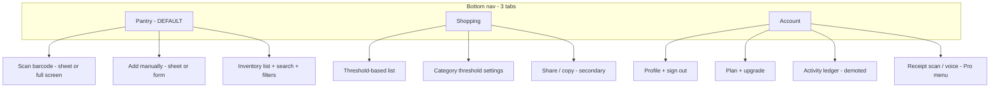

# PP-042 Designer Handoff — Pantry Hub Dashboard

**Client:** Peak Collective LLC dba Pantry Hub  
**Live site:** https://www.mypantryhub.com  
**Design kit preview:** https://www.mypantryhub.com/design-system/  
**Ticket:** `.agents/tickets/PP-042-dashboard-design-review.md`  
**Date:** 2026-07-11

---

## 1. Executive summary

Pantry Hub is a consumer pantry inventory app. The logged-in dashboard tries to do too much on one screen and duplicates entry points. We need a **streamlined, mobile-first redesign** focused on three jobs:

1. **Add** — scan barcode or manually add to inventory (1 tap from landing)
2. **View** — see full inventory list with search and low/out filters
3. **Shop** — auto-generated list when qty falls below per-category thresholds

**Visual direction:** Light mode, clean, calm. **Emerald green** primary, **amber orange** for low-stock and upgrade accents. No dark glassmorphism (that's ShipInADay playbook — not us). No emoji in primary UI — use Lucide icons (already in repo).

---

## 2. Brand

| Field | Value |
|-------|-------|
| Customer name | Pantry Hub |
| Legal | Peak Collective LLC dba Pantry Hub |
| Contact | info@mypantryhub.com |
| Tagline | Smart Home Inventory & Shopping Lists |
| Marketing palette | Emerald `#059669` + amber `#f59e0b` on slate-50 bg |

---

## 3. Audit — current state (for reference)

Sign in at https://www.mypantryhub.com/auth/signin/ and review:

| URL | What you'll see | Problem |
|-----|-----------------|---------|
| `/dashboard/` | Stats, quick actions, previews, categories, activity, inline add | Competes with inventory; not goal-focused |
| `/dashboard/inventory/` | Real list + toolbar | Should be **default landing**, not 2nd tab |
| `/dashboard/shopping-list/` | Auto list + buried threshold settings in "More" menu | Goal 3 works but UI is cluttered |
| `/dashboard/ledger/` | Activity ledger | Rarely needed — demote |

**Current nav (4 tabs):** Dashboard · Inventory · Shopping · Ledger — emoji icons, bottom bar on mobile.

---

## 4. Proposed information architecture



### Route mapping (implementation note for dev — not designer scope)

| Proposed tab | Maps to |
|--------------|---------|
| Pantry | `/dashboard/inventory/` becomes default; deprecate `/dashboard/` home |
| Shopping | `/dashboard/shopping-list/` |
| Account | New shell or `/dashboard/account/` |

---

## 5. Screen specifications

### 5.1 Pantry (default landing) — Goals 1 + 2

**Mobile wireframe**

```
┌─────────────────────────────────┐
│  Pantry Hub              [👤]   │  ← wordmark + UserButton
├─────────────────────────────────┤
│ ┌─────────────┐ ┌─────────────┐ │
│ │  Scan item  │ │ Add manual  │ │  ← equal width, primary + secondary
│ └─────────────┘ └─────────────┘ │
│ ┌─────────────────────────────┐ │
│ │ 🔍 Search items...          │ │
│ └─────────────────────────────┘ │
│ [All] [Low] [Out]     Sort ▾   │  ← chips, not 5 stat cards
├─────────────────────────────────┤
│ Milk          2 cartons    − +  │
│ Eggs          12           − +  │
│ Rice     LOW  0            − +  │  ← amber badge
│ ...                             │
│                                 │
└─────────────────────────────────┘
│ Pantry │ Shopping │ Account    │
```

**Desktop:** Same content; hero buttons stay top; nav moves to **top bar** (playbook pattern).

**Interactions to design:**

| Action | Behavior |
|--------|----------|
| Scan item | Opens camera scanner (existing flow); confirm modal after detect |
| Add manually | Bottom sheet or inline form — name, qty, unit, category |
| Search | Filters list client-side by name |
| Low / Out chips | Filters list (replaces stat card row) |
| − / + | Adjust qty inline (existing) |
| Row tap | Optional: expand for edit, link barcode, delete |

**Empty state:** Illustration or icon + "Your pantry is empty" + single CTA "Add your first item"

**Remove from this screen:** Category pill grid, recent activity, inline quick-add bar, voice FAB, receipt scan in hero, table/card toggle (pick **list rows** as default).

---

### 5.2 Shopping — Goal 3

**Logic (already built — design the presentation):**

- Each category has a **low-stock threshold** (defaults: produce 3, pantry 2, dairy 2, frozen 1, meat 1, beverages 2, snacks 2, other 2)
- When `item.quantity <= threshold`, item appears on shopping list
- List auto-regenerates when inventory changes
- User can check off items, adjust suggested buy qty, add manual items

**Mobile wireframe**

```
┌─────────────────────────────────┐
│ Shopping list          [⚙]      │  ← thresholds always visible, not buried in More
├─────────────────────────────────┤
│ Based on your stock levels      │  ← subtitle
│                                 │
│ ☐ Milk                          │
│   Need 2 · have 1 · produce     │  ← show WHY item is here
│                                 │
│ ☐ Rice                          │
│   Out of stock                  │
│                                 │
│ [ + Add item ]                  │
├─────────────────────────────────┤
│ [ Regenerate ]  [ Share ]       │  ← secondary row
└─────────────────────────────────┘
```

**Threshold settings panel** (redesign current modal):

- One row per category: label + number stepper
- "Reset to defaults" link
- Save closes panel

**Demote to overflow menu:** Session history, print, shopping session (Pro), clear all

---

### 5.3 Account

```
┌─────────────────────────────────┐
│ Account                         │
├─────────────────────────────────┤
│ [avatar] user@email.com         │
│ Plan: Free · [Upgrade]          │  ← amber upgrade button
├─────────────────────────────────┤
│ Subscription & billing          │
│ Low stock thresholds →          │  ← optional duplicate entry
│ Activity ledger →               │
│ Receipt scan (Pro) →            │
│ Help · Sign out                 │
└─────────────────────────────────┘
```

---

## 6. Design system

### 6.1 Color tokens

Implemented in `frontend/app/globals.css` and previewed at `/design-system/`.

| Token | Hex | Usage |
|-------|-----|-------|
| `--primary` | `#059669` | CTAs, active nav, in-stock |
| `--primary-light` | `#d1fae5` | Active chip, nav bg |
| `--accent` | `#f59e0b` | Low stock, upgrade |
| `--accent-light` | `#fef3c7` | Low stock row tint |
| `--background` | `#f8fafc` | Page |
| `--surface` | `#ffffff` | Cards |
| `--foreground` | `#0f172a` | Text |
| `--muted` | `#64748b` | Secondary text |
| `--border` | `#e2e8f0` | Dividers |
| `--danger` | `#f43f5e` | Errors, out of stock emphasis |

### 6.2 Typography

| Role | Font | Size | Weight |
|------|------|------|--------|
| Page title | Inter | 24px | 700 |
| Section title | Inter | 18px | 600 |
| Body / list | Inter | 16px | 400–500 |
| Caption | Inter | 12–14px | 400, muted color |
| Marketing H1 | Lora | — | — | **Not in dashboard** |

### 6.3 Components

| Component | Spec |
|-----------|------|
| Primary button | `bg-primary`, white text, `rounded-xl`, `px-4 py-3`, Lucide icon left |
| Secondary button | White surface, border, same radius |
| Accent button | `bg-accent` — upgrade + urgent low-stock only |
| Card | White, `border`, `rounded-2xl`, `shadow-sm` |
| Filter chip | Active: primary-light bg; inactive: white + border |
| Status badge | Pill, `text-xs font-semibold` |
| Nav item | Lucide 20px + label 12px; active = primary on primary-light |

### 6.4 Spacing

- Page horizontal: 16px mobile / 24px desktop
- Section vertical gap: 16px (tighter than current 24px)
- Card padding: 16px mobile

### 6.5 Iconography

- **Library:** Lucide React (installed)
- **Size:** 20px nav, 18–20px inline
- **Do not use:** Emoji in nav, buttons, or category headers

---

## 7. What we need back from you

Please deliver:

1. **Figma (or equivalent)** with mobile + desktop frames for Pantry, Shopping, Account
2. **Scan flow** — camera overlay + product confirm modal
3. **Add manually** — sheet or modal states (empty, validation error, success)
4. **Threshold settings** — redesigned panel
5. **Empty states** — empty pantry, empty shopping list, all stocked
6. **Component sheet** — buttons, chips, badges, nav, list rows with spacing annotations
7. **Brief changelog** — what you changed vs this doc and why

---

## 8. Out of scope (this phase)

- Marketing landing page redesign (done in PP-041)
- Dark mode
- New features (expiry tracking UI — stats exist but data is 0)
- Illustration commission (optional — icon-only empty states OK)

---

## 9. Code references (for dev handoff after design)

| File | Purpose |
|------|---------|
| `frontend/lib/design-tokens.ts` | Token constants |
| `frontend/app/globals.css` | CSS variables |
| `frontend/app/design-system/page.tsx` | Live component preview |
| `frontend/components/dashboard/navbar.tsx` | Current nav — replace |
| `frontend/components/dashboard/views/inventory-view.tsx` | Pantry merge target |
| `frontend/components/dashboard/views/shopping-list-view.tsx` | Shopping redesign target |
| `frontend/contexts/pantry-provider.tsx` | `generateShoppingList`, thresholds |

---

## 10. Acceptance criteria

- [ ] Designer mockups approved by product owner
- [ ] 3-tab nav, Pantry default, no emoji in primary UI
- [ ] Scan + Add reachable in 1 tap from landing
- [ ] Shopping list shows "why" per item (threshold context)
- [ ] Tokens match `/design-system/` preview
- [ ] Dev implementation ticket created (PP-043) from approved designs